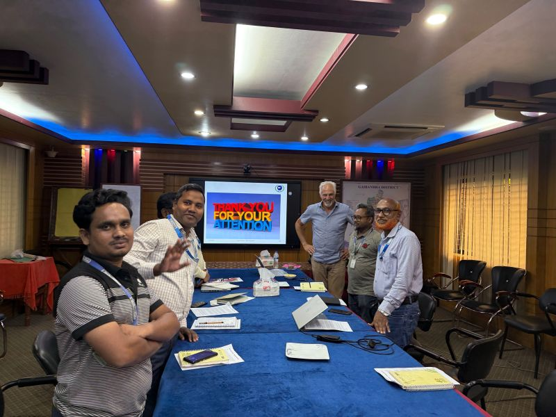
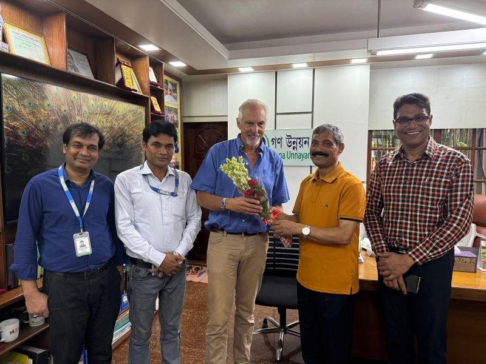

Just wanted to share that I completed my 20th successful PUM mission.

This latest project took me to Bangladesh, Gaibandha district, a very poor area in the North , where I had the opportunity to advise GUK, a large NGO on the development of a mid-sized bakery. It has been both rewarding and inspiring to contribute my expertise and to support local entrepreneurship in such a tangible way.

Looking back on these 20 missions, I feel grateful for the trust, the cultural exchanges, and the chance to make a positive impact across different communities worldwide.

Here’s to many more meaningful projects to come!

