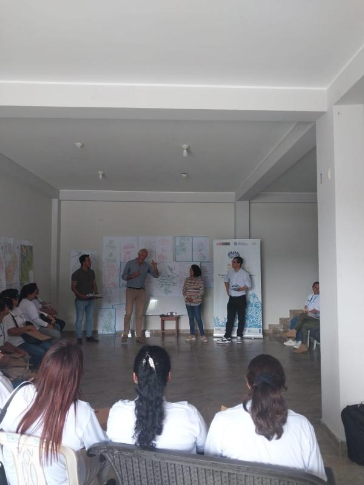
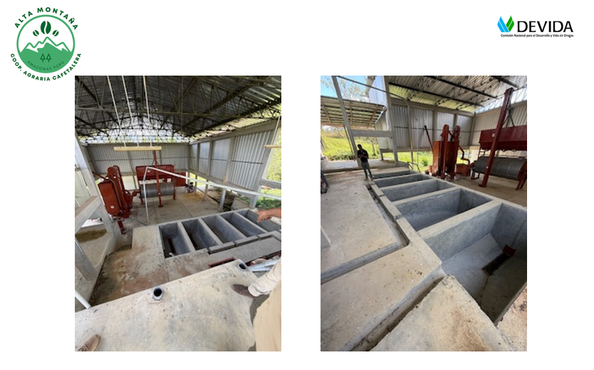
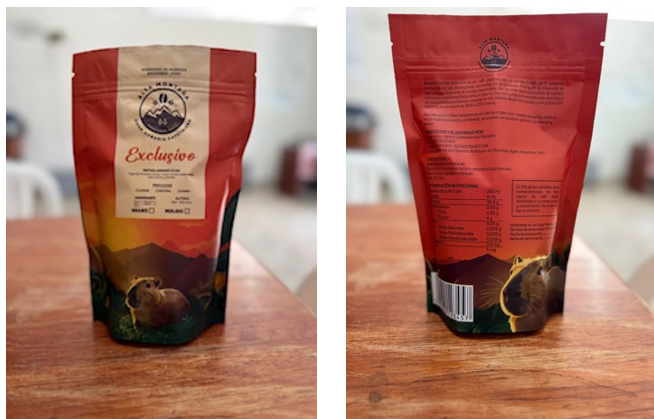
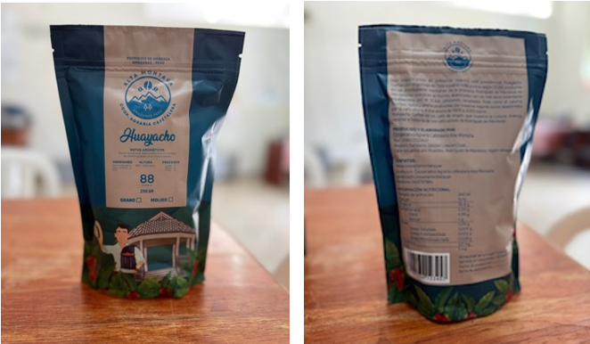

# From a Fragmented Cooperative to a Controlled Specialty Coffee Model: Alta Montaña’s Strategic Transformation Roadmap

A cooperative with 390 members, Organic and Fair Trade certifications, a cupping lab, and a domestic brand—yet still struggling with low productivity, high costs, and thin margins. That was the reality for Alta Montaña in the Amazonas region of Peru.

The question wasn’t “Does it have potential?”—it was: **How can we move from a traditional agricultural cooperative to a specialty coffee business model governed by data, processes, and a long-term strategy?**

## Project background

- **Country:** Peru
- **Region:** Amazonas – Rodríguez de Mendoza
- **Model:** Cooperative producing and exporting specialty coffee
- **Members:** ~390 farmers
- **Certifications:** Organic, Fair Trade, Rainforest
- **Markets:** Green coffee exports + domestic market (roasted coffee)

Alta Montaña had many strengths:

- 70% of each member’s production sold through the cooperative
- 18 green-coffee customers
- Cupping lab and roaster
- A brand already present in the domestic market
- Diversification: roasted coffee, café shop, services

However, internal analysis showed:

- No HACCP
- Output decreased by more than 100,000 kg (2023–2024)
- Post-harvest not centrally controlled
- Wet mill plant is over capacity but operates only 2 months/year
- Old machinery and misaligned investment structure
- Weak financial management capability
- Farmers still sell 30% of their output outside the cooperative

High potential—but an inefficient structure.

## HLG Mooren Consulting’s approach

We delivered advisory based on four strategic pillars:

### 1️⃣ Centralization Strategy – Centralize to control quality

**Current state:**

- Fermentation done at farm level
- Drying is decentralized
- Inconsistent quality
- No production KPIs by process step

**Proposed solution:**

- Centralize key steps:
  - Despulping (wet mill)
  - Fermentation
  - Drying
  - Cleaning
  - Packing

- Build KPI tracking by stage:
  - Kg after harvest
  - Kg after despulping
  - Kg after fermentation
  - Kg after drying
  - Kg of green beans

Shift from a “collection” model to a “value chain control” model.

### 2️⃣ Costing & Financial Control – Calculate right to decide right

Cost analysis was conducted on two levels:

**Farmer level:**

- Fertilizers
- Harvesting costs
- Fermentation
- Drying
- Cost/kg of pergamino

**Cooperative level:**

- Procurement
- Internal logistics
- Certifications
- Storage
- Testing
- Export documentation

A costing example for 1 kg of roasted coffee highlighted:

- 20% weight loss from cleaning + 15% from roasting
- Major impact from packaging and labeling
- Internal transportation costs

Clear message: **Without cost control, there can be no pricing strategy.**

### 3️⃣ Marketing Strategy – From “score” to storytelling

Market analysis showed:

- European consumers don’t care much about SCA scoring systems
- They care about:
  - Origin
  - Altitude
  - Organic
  - Fair trade
  - Sustainability
  - Storytelling

Strategic direction:

- Build an “umbrella brand”: Alta Montaña
- Anchor it to:
  - Peru → Amazonas → Huayacho

- Emphasize:
  - Tropical rainforest (selva tropical)
  - Social impact (impacto social)
  - Sustainable agriculture (agricultura sostenible)

Positioning shifts from “coffee score” to “coffee story.”

### 4️⃣ HACCP & Business Dashboard – Professionalize management

There was no HACCP in place.

Direction:

- Implement HACCP – Hazard Analysis Critical Control Points
- Set up a Business Dashboard
- Monthly/quarterly/annual reporting
- Budget vs. Actual tracking
- Rolling forecast projections

Move from reactive management to proactive management.

## Specific solutions implemented

### 🔹 1. Optimize the central plant

- Retain core infrastructure
- Replace large machines with smaller, more flexible equipment
- Increase operating time to > 2 months/year
- Reduce wasted capex

### 🔹 2. Standardize production processes

Establish detailed protocols for:

- Variety selection (Bourbon, Caturra, Geisha, etc.)
- Color and ripeness control at harvest
- Fermentation methods: washed / honey / natural
- Drying with moisture control
- Selection by size and color
- Roasting protocols

### 🔹 3. Flexible pricing strategy

Apply:

- Cost-plus pricing
- Competitive pricing
- Skimming
- Penetration
- Value-based pricing

By segment: green bean exports vs. domestic roasted coffee.

  

### 🔹 4. Peru domestic B2C strategy

Analysis showed:

- 90% of Peruvian coffee is exported
- The domestic market grows slowly but steadily
- 1% of big-city population is a potential target segment

Focus on:

- Lima, Arequipa, Trujillo
- HoReCa, gourmet stores
- Social media and storytelling

## Value delivered

The strategy was designed to:

- Stabilize quality and output
- Improve plant utilization efficiency
- Reduce post-harvest losses
- Improve margins
- Build a strong origin-based brand
- Increase transparency and professionalism

Alta Montaña is not just a cooperative—it has the potential to become a **modern coffee enterprise model in Amazonas**.
