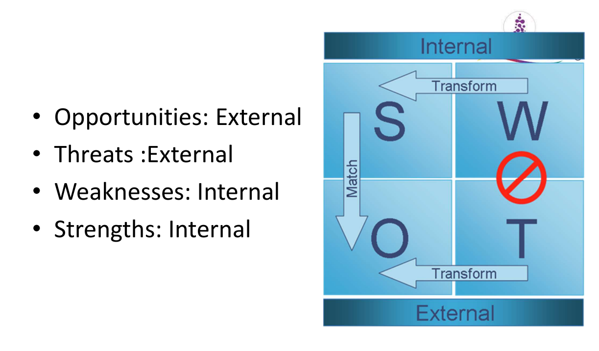
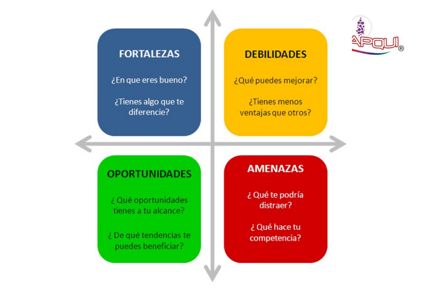
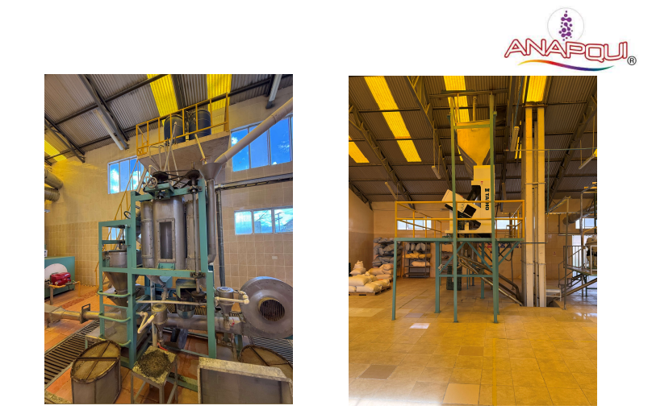
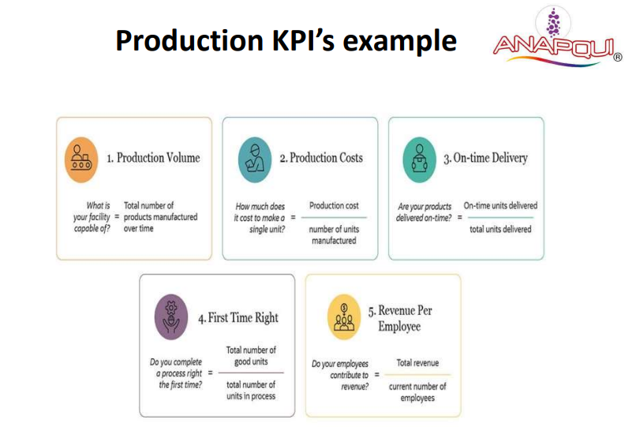

## Từ Xuất Khẩu Nguyên Liệu Thô Đến Thương Hiệu Tiêu Dùng Cao Cấp: Hành Trình Chuyển Mình Của ANAPQUI

Sở hữu nguồn nguyên liệu hữu cơ "vàng" nhưng tại sao biên lợi nhuận vẫn mỏng và nhà máy trị giá hàng triệu đô chỉ chạy 10% công suất? Đó là bài toán hóc búa về quản trị chuỗi cung ứng và định vị thương hiệu mà một hiệp hội nông nghiệp quy mô lớn tại Nam Mỹ đã phải đối mặt trước khi tìm đến HLG Mooren Consulting.

**Bối Cảnh Dự Án: Nghịch Lý Của Người Khổng Lồ**ANAPQUI là tổ chức quy tụ hơn 1.500 nông dân tại Bolivia, sở hữu vùng trồng Quinoa (diêm mạch) Hoàng gia hữu cơ độc quyền và lớn nhất thế giới. Dù sở hữu hai nhà máy chế biến chuẩn ISO 22000, doanh nghiệp này vẫn mắc kẹt trong cái bẫy "bán buôn nguyên liệu thô".

Tại thời điểm chúng tôi tiếp nhận, ANAPQUI phụ thuộc quá lớn vào việc xuất khẩu hạt Quinoa đóng bao 25kg, khiến họ trở thành người chịu giá (price taker) trước những biến động thất thường của thị trường thế giới. Mảng sản phẩm tiêu dùng (B2C) nội địa dù có tiềm năng nhưng lại thiếu vắng một chiến lược tiếp thị sắc bén, bao bì chưa đủ sức cạnh tranh và thiếu hụt mạng lưới phân phối vào hệ thống bán lẻ hiện đại. Hơn thế nữa, bài toán về sự gắn kết lỏng lẻo của các hộ nông dân thành viên cũng đe dọa trực tiếp đến chuỗi cung ứng đầu vào.

**Phương Pháp Tiếp Cận: Giải Phẫu Chuỗi Giá Trị**Thay vì đưa ra những lời khuyên viển vông, chuyên gia Hugo Mooren đã trực tiếp đi sâu vào thực địa, rà soát lại toàn bộ "sức khỏe" của doanh nghiệp. Chúng tôi áp dụng phương pháp luận bài bản với Ma trận SWOT, BCG Matrix và Phân tích Chuỗi giá trị (Value Chain Analysis) để đánh giá lại từ khâu thu mua, năng lực sản xuất tại nhà máy Challapata và El Alto, cho đến chiến lược giá và kênh phân phối. Mục tiêu tối thượng là: Dịch chuyển từ số lượng sang chất lượng, và từ nguyên liệu thô sang sản phẩm giá trị gia tăng cao.

  
  

**Giải Pháp Chiến Lược Đã Triển Khai**Dựa trên những chẩn đoán thực tế, HLG Mooren Consulting đã thiết kế một lộ trình chuyển đổi toàn diện, tập trung vào các chuyên môn cốt lõi:

- **Định vị lại Chiến lược Tiếp thị (Marketing Strategy):** Chúng tôi phân tách rõ ràng hai mặt trận. Với B2C nội địa, tập trung vào tệp khách hàng trung lưu thành thị thông qua thông điệp "An toàn, Dinh dưỡng & Tự hào quốc gia". Các dòng sản phẩm tiềm năng như ngũ cốc, mì ống (pasta) và bánh quy không gluten được tái định vị để nhắm vào xu hướng ăn uống lành mạnh.
- **Chiến lược Xuất khẩu Cấp cao (Export Strategy):** Thay vì bán hàng đại trà, chúng tôi xây dựng bộ tiêu chí chọn lọc nhà phân phối khắt khe (Distributor Checklist) nhằm tìm kiếm các đối tác chiến lược tại thị trường trọng điểm Châu Âu (Đức, Pháp, Tây Ban Nha). Chuyển đổi định vị từ "Quinoa bán buôn" sang "Quinoa Hoàng gia hữu cơ" dành riêng cho các chuỗi siêu thị và đối tác Private Label (nhãn hàng riêng).
- **Tái cấu trúc Vận hành & Thiết lập KPI (Operations & Turnaround):** Để khắc phục tình trạng quản lý lỏng lẻo, chúng tôi đã đưa ra bộ chỉ số đo lường hiệu suất (Dashboard KPI) trực quan cho nhà máy: Đo lường khối lượng sản xuất, chi phí trên từng đơn vị sản phẩm, tỷ lệ giao hàng đúng hạn và tỷ lệ làm đúng ngay từ đầu (First Time Right).

- **Chiến lược Nhân sự & Nguồn cung (HR & Supply Chain):** Thiết lập quy trình giao tiếp mới qua các nhóm công nghệ số và đại diện vùng để gắn kết trực tiếp với 1.500 nông dân, đảm bảo sự trung thành và nguồn cung hạt Quinoa chất lượng cao, ổn định.

**Giá Trị Mang Lại**Với chiến lược được thiết kế lại bởi HLG Mooren Consulting, ANAPQUI đã nắm trong tay một bản đồ tư duy rõ ràng để xoay chuyển tình thế. Khung chiến lược mới không chỉ giúp họ tối ưu hóa công suất của các dây chuyền sản xuất trị giá hàng triệu đô, mà còn tạo ra rào cản cạnh tranh lớn bằng cách nâng tầm giá trị thương hiệu. Họ đã sẵn sàng để không chỉ là người trồng trọt, mà là những người làm chủ chuỗi giá trị thực phẩm hữu cơ trên trường quốc tế.

_Doanh nghiệp bạn đang mắc kẹt trong việc bán nguyên liệu thô biên lợi nhuận thấp và muốn chuyển mình thành một thương hiệu giá trị cao? Hãy liên hệ với HLG Mooren Consulting để được chẩn đoán và tư vấn chiến lược phù hợp nhất._
