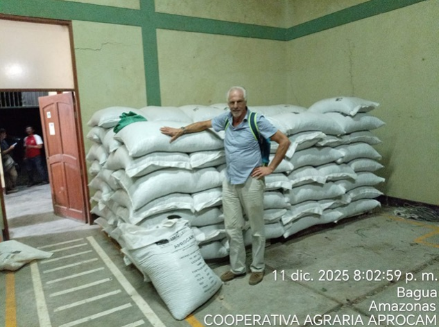
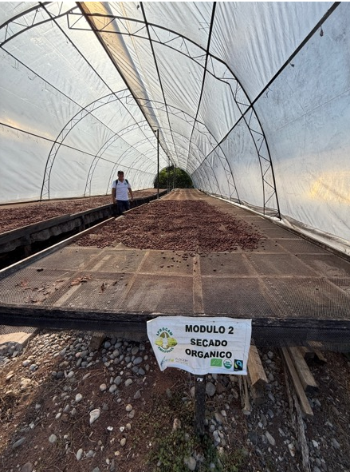
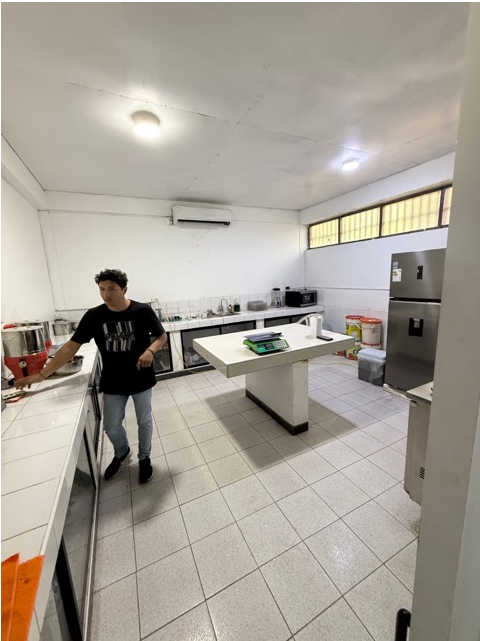
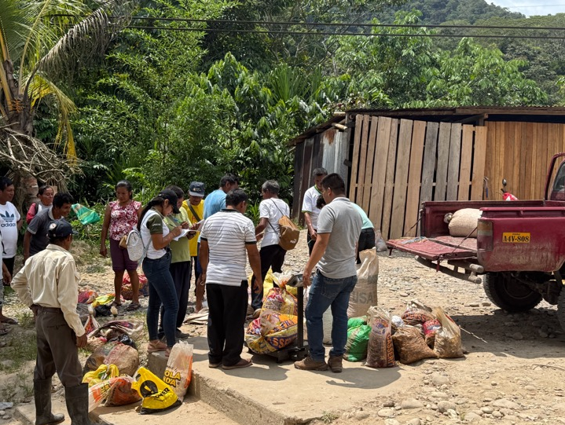

# Từ sụt giảm 50% sản lượng đến lộ trình 350.000kg: Kế hoạch tái cấu trúc 5 năm của Hợp tác xã cacao Aprocam

Khi sản lượng bán ra giảm 50% chỉ trong một năm, đó không còn là biến động thị trường — mà là dấu hiệu của một khủng hoảng cấu trúc. Aprocam, hợp tác xã cacao tại Bagua, Peru, đứng trước ba thách thức lớn: phụ thuộc gần như hoàn toàn vào một khách hàng, mất nông dân vì thiếu dòng tiền, và suy giảm sản lượng nghiêm trọng.

Nhưng thị trường cacao toàn cầu lại đang ở một bước ngoặt: giá cao kỷ lục, nhu cầu cacao chất lượng cao tăng mạnh, đặc biệt tại châu Âu. Câu hỏi đặt ra không phải là “có cơ hội hay không” — mà là **làm thế nào để nắm bắt cơ hội bằng một chiến lược dài hạn và bài bản**.

## Bối cảnh dự án

- **Quốc gia:** Peru
- **Khu vực:** Bagua – Amazonas
- **Mô hình:** Hợp tác xã cacao hữu cơ, chế biến tập trung
- **Sản phẩm:** Cacao organic & conventional
- **Vấn đề chính:** \* Sản lượng bán giảm 50% trong năm gần nhất

      *   80% doanh thu phụ thuộc một nhà sản xuất chocolate Ý

      *   Dòng tiền yếu → mất nông dân

      *   Nợ tài chính lớn

      *   Hệ thống thương mại yếu

      *   Không có chiến lược 5 năm rõ ràng

  

Tuy nhiên, Aprocam có nền tảng tốt:

- Chứng nhận Organic
- Chứng nhận Fair Trade
- Cơ sở vật chất riêng
- Quy trình lên men và sấy tập trung
- Quan hệ tốt với khách hàng chính

Thách thức không phải là thiếu tiềm năng — mà là thiếu cấu trúc chiến lược.

## Phương pháp tiếp cận của HLG Mooren Consulting

Chúng tôi triển khai tư vấn theo 4 trụ cột chiến lược:

### 1️⃣ Tái định vị chiến lược: “Value over Volume”

Phân tích thị trường cho thấy:

- Thị trường cacao đang chuyển sang premium & specialty
- Giá cao nhưng rủi ro sản xuất lớn
- Sản phẩm không khác biệt sẽ bị loại khỏi chuỗi giá trị

Kết luận chiến lược:👉 Tập trung vào **cacao premium, truy xuất nguồn gốc rõ ràng, chất lượng ổn định**

### 2️⃣ Chuẩn hóa quy trình chế biến tập trung

Rủi ro khi mở trái cacao tại nông trại:

- Lên men không kiểm soát
- Nguy cơ mốc, acid hóa
- Giảm giá trị thương mại

Giải pháp:

- Vận chuyển nguyên trái về trung tâm
- Lên men – sấy – làm sạch tập trung
- Thiết lập kiểm soát thời gian, nhiệt độ, oxy
- 4 điểm đo KPI sản lượng:
  1.  Kg thu hoạch
  2.  Kg lên men
  3.  Kg sấy
  4.  Kg làm sạch

Tư duy chuyển từ “thu gom sản lượng” sang “kiểm soát giá trị”.

### 3️⃣ Đa dạng hóa khách hàng & giảm rủi ro tập trung

Hiện trạng:

- 80% bán cho 1 khách hàng Ý
- 20% cho 1 khách hàng Bỉ

Chiến lược 5 năm đặt mục tiêu:

- Không khách hàng nào vượt 60%
- Tìm 5 khách hàng mới trong năm 2
- Hình thành liên minh với các hợp tác xã khác (năm 3)

Đây là chiến lược **quản trị rủi ro thương mại**, không chỉ là mở rộng bán hàng.

### 4️⃣ Lộ trình tăng trưởng 5 năm

Chiến lược được cụ thể hóa theo từng năm:

**Năm 1**

- Khôi phục nông dân đã rời đi
- Tăng sản lượng lên 175.000kg
- Tận dụng tối đa công suất hiện tại

**Năm 2**

- Đạt chứng nhận HACCP
- Chuẩn hóa website & truyền thông
- Giảm phụ thuộc khách hàng
- Doanh số mục tiêu: 200.000kg

**Năm 3**

- Liên minh với hợp tác xã khác
- Doanh số: 250.000kg

**Năm 4**

- Tối ưu logistics (20ft → 40ft container)
- Giảm chi phí lab
- Trả nợ tài chính
- Break-even tại 300.000kg

**Năm 5**

- Đạt 350.000kg
- Đầu tư thiết bị mới
- Mở rộng quy mô

Đây không phải kế hoạch tăng trưởng “ước mơ”, mà là roadmap có thứ tự ưu tiên rõ ràng.

## Giá trị mang lại

Chiến lược được xây dựng nhằm:

- Chuyển từ phụ thuộc sang đa dạng hóa
- Nâng cấp từ volume supplier sang premium supplier
- Tăng giá trị nhờ truy xuất nguồn gốc & chất lượng ổn định
- Cải thiện dòng tiền và giữ chân nông dân
- Đưa hợp tác xã về trạng thái tài chính khỏe mạnh sau 4 năm

Quan trọng nhất: Aprocam có một kế hoạch hành động rõ ràng cho từng năm, thay vì phản ứng theo thị trường.

## Hợp tác xã của bạn có đang phụ thuộc quá nhiều vào một khách hàng?

Nếu 80% doanh thu đến từ một đối tác, nếu sản lượng giảm do thiếu dòng tiền, nếu chiến lược dài hạn chưa rõ ràng — rủi ro chỉ là vấn đề thời gian.

**Hợp tác xã hoặc doanh nghiệp của bạn đang gặp thách thức tương tự?Hãy liên hệ HLG Mooren Consulting để xây dựng kế hoạch chiến lược 5 năm phù hợp với thực tế của bạn.**
