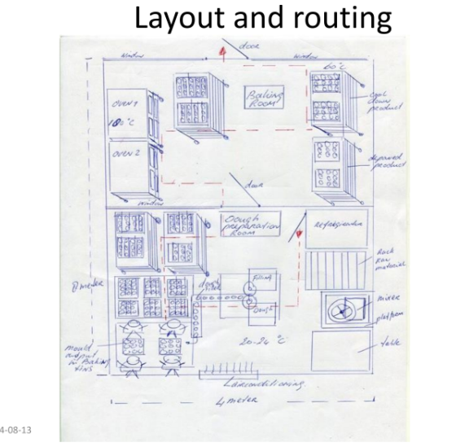
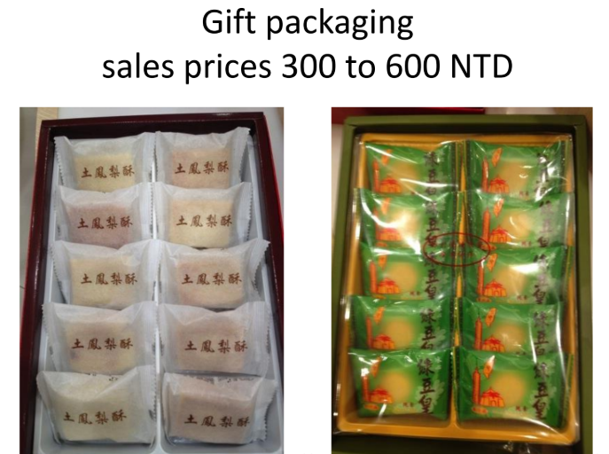

## Mở Khóa Thị Trường Bánh Ngọt: Lộ Trình Phát Triển Sản Phẩm Mới & Chuyển Đổi Mô Hình Của CSC Foods

Chuyển đổi từ việc cung cấp nguyên liệu thô B2B sang phát triển một dòng sản phẩm tiêu dùng B2C hoàn toàn mới luôn là một canh bạc lớn. Làm thế nào để thiết lập một dây chuyền sản xuất tự động từ con số không, phát triển công thức chuẩn vị và thâm nhập thành công vào một thị trường bán lẻ đầy tính cạnh tranh?

**Bối cảnh dự án: Tham vọng bước ra khỏi "vùng an toàn"** CSC Foods là một doanh nghiệp gia đình lâu đời tại Thái Lan, vốn có thế mạnh truyền thống trong việc sản xuất mạch nha và mứt dứa phân phối mô hình B2B . Nhận thấy tiềm năng khổng lồ từ thị trường quà tặng du lịch (đặc biệt là khu vực Bangkok), ban lãnh đạo quyết định rẽ hướng sang sản xuất Bánh dứa (Pineapple cake) theo mô hình B2C.

Tuy nhiên, tham vọng vươn ra thị trường nội địa và xuất khẩu (tới Hawaii, Châu Âu) của họ vấp phải những rào cản nội tại rất lớn: doanh nghiệp hoàn toàn chưa có kinh nghiệm sản xuất bánh ngọt, chưa từng vận hành máy móc tự động hóa ngành bánh, và thiếu hụt trầm trọng mạng lưới phân phối cũng như sự am hiểu về thị trường du lịch .

**Phương pháp tiếp cận của chúng tôi: Chiến lược bao trùm Chuỗi giá trị** Dưới sự dẫn dắt của chuyên gia Hugo Mooren, HLG Mooren Consulting không chỉ đóng vai trò cố vấn kỹ thuật mà còn là kiến trúc sư trưởng cho toàn bộ dự án. Bằng việc áp dụng phân tích SWOT kết hợp với ma trận tăng trưởng, chúng tôi tận dụng tối đa lợi thế sẵn có của CSC Foods (như nguồn lực tài chính ổn định, chi phí nhân công hợp lý và khả năng tự chủ nguồn mứt dứa nguyên liệu) để bù đắp cho những lỗ hổng về kiến thức thị trường . Lộ trình tư vấn được thiết kế xuyên suốt: từ R&D công thức, set-up mặt bằng nhà xưởng, đến định giá và xây dựng mạng lưới B2B2C .

**Giải pháp chiến lược đã triển khai** Chúng tôi đã cung cấp một bản thiết kế "chìa khóa trao tay" (turnkey) về mặt chiến lược cho hệ thống vận hành mới:

- **Thiết kế Xưởng & Đồng bộ hóa Năng lực Sản xuất:** Xây dựng bản vẽ layout mặt bằng di chuyển một chiều (routing), bố trí hợp lý từ phòng chuẩn bị bột, khu vực tạo hình (với máy Rheon chuyên dụng), khu vực nướng (Oven) đến phòng làm mát và đóng gói . Chúng tôi tính toán chi tiết bài toán "nút thắt cổ chai" (bottleneck) để đảm bảo số lượng lò nướng đồng bộ hoàn hảo với tốc độ nhả bột của máy tạo hình tự động .
  
- **Nghiên cứu & Chuẩn hóa Công thức (R&D):** Phát triển nhiều biến thể công thức vỏ bánh (sử dụng bơ nguyên chất hoặc shortening) nhằm tối ưu hóa giá thành nhưng vẫn giữ được hương vị phù hợp với thị hiếu Châu Âu . Quan trọng nhất, chúng tôi thiết lập các thông số kiểm soát thời hạn bảo quản (shelf-life) lên tới 6 tháng thông qua việc quản lý độ pH và hoạt độ nước (AW: 0.6 - 0.7) của nhân mứt – yếu tố sống còn để phục vụ xuất khẩu .
- **Chiến lược Giá & Bao bì Đa phân khúc:** Thiết lập chiến lược hai tầng rõ rệt: Bao bì tiêu chuẩn (Retail packaging) với trọng lượng 30g nhắm vào mức giá phổ thông, và Bao bì quà tặng cao cấp (Gift packaging) 50g với thiết kế sang trọng hướng đến biên lợi nhuận cao (premium margin) tại các điểm du lịch .
  
- **Xây dựng Mạng lưới Phân phối:** Cung cấp bộ công cụ đánh giá năng lực nhà phân phối (Distributor checklist) bài bản. Lên danh mục khách hàng chiến lược, tiếp cận trực tiếp vào các chuỗi cửa hàng tiện lợi lớn nhất quốc gia, siêu thị cao cấp và các hệ thống đại lý lữ hành .

**Kết quả kỳ vọng: Chuyển đổi để Dẫn đầu** Với lộ trình thực thi bài bản từ HLG Mooren Consulting, CSC Foods đã được trang bị đầy đủ "vũ khí" để tham chiến ở một sân chơi mới . Từ một bảng cấu thành chi phí (costing) chi tiết cho từng chiếc bánh, đến một quy trình sản xuất đáp ứng tiêu chuẩn an toàn quốc tế (chuẩn bị tích hợp BRC), doanh nghiệp đã sẵn sàng tự tin giới thiệu sản phẩm ra thị trường Thái Lan và từng bước chinh phục các đối tác nhập khẩu toàn cầu.

_Doanh nghiệp bạn đang ấp ủ một dòng sản phẩm mới nhưng chật vật trong khâu thiết lập sản xuất và bế tắc về chiến lược thâm nhập thị trường? Hãy liên hệ với HLG Mooren Consulting để thiết lập lộ trình tăng trưởng vững chắc và giảm thiểu tối đa rủi ro đầu tư._
