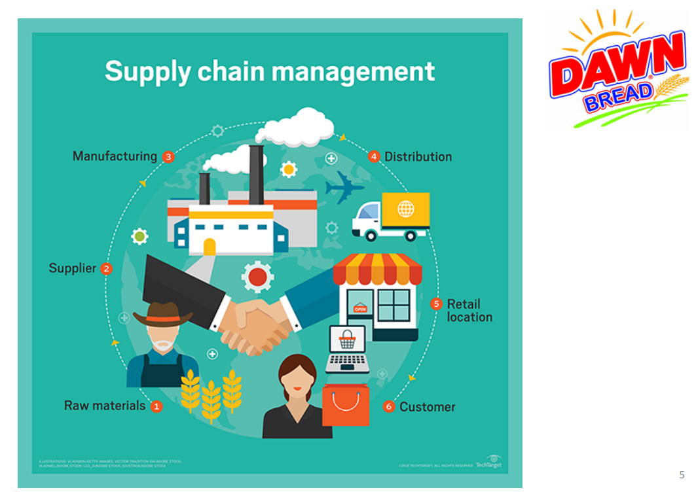
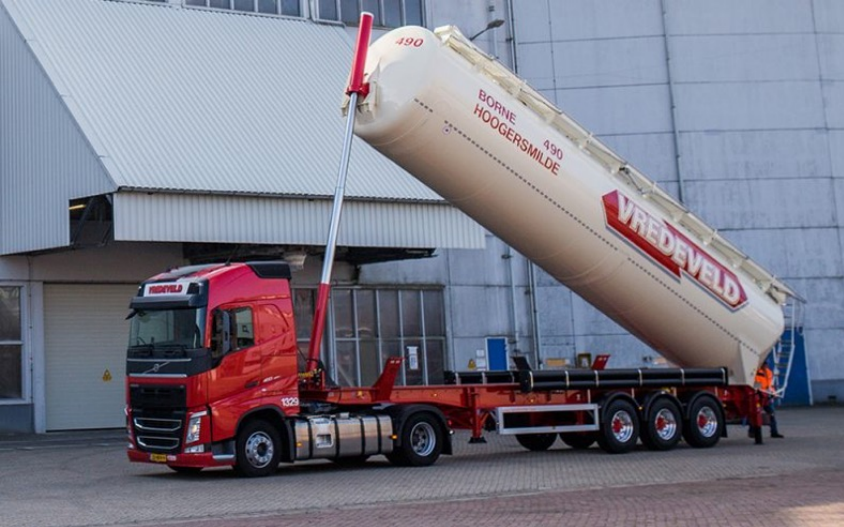
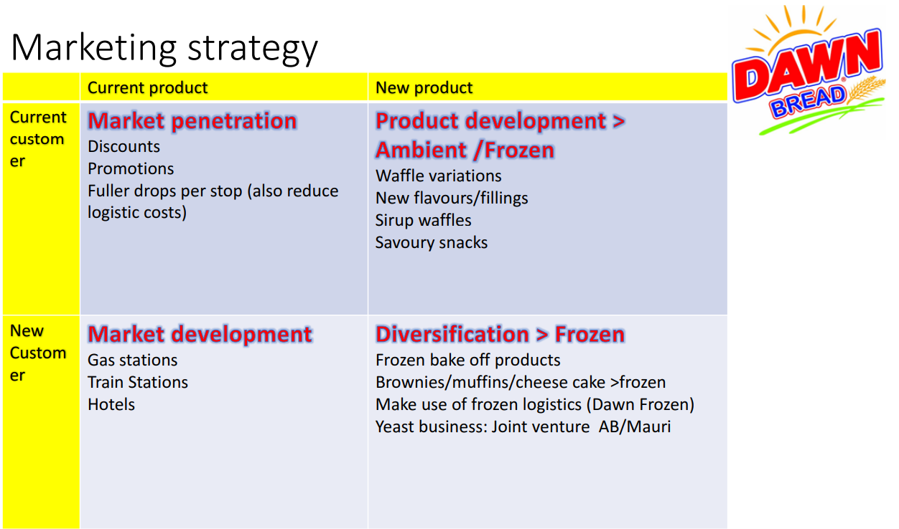

## Phá Vỡ Giới Hạn Không Gian: Bài Toán Tối Ưu Chuỗi Cung Ứng & Vận Hành Cho "Ông Lớn" Dawn Bread

Khi doanh nghiệp đạt tốc độ tăng trưởng nóng, "chiếc áo" hạ tầng và quy trình cũ kỹ sẽ nhanh chóng trở nên chật chội. Làm thế nào để một thương hiệu FMCG hàng đầu giải quyết ách tắc không gian, tối ưu hóa chuỗi cung ứng khổng lồ và tăng thêm 20% công suất mà không cần tốn hàng triệu đô la mở rộng diện tích nhà máy? Đó là thách thức mà HLG Mooren Consulting đã trực tiếp giải quyết.

**Bối Cảnh Dự Án: Chiếc Áo Chật Của Kẻ Dẫn Đầu** Dawn Bread là thương hiệu bánh mì chiếm thị phần thống lĩnh tại Lahore, Pakistan – một thị trường với mật độ dân số đông đúc và đang có xu hướng dịch chuyển mạnh mẽ sang tiêu dùng hiện đại. Dù phục vụ mạng lưới khổng lồ lên tới hàng ngàn khách hàng B2B và siêu thị mỗi ngày, nhà máy trung tâm của họ lại đang phải đối mặt với vô vàn nút thắt cổ chai.

Hoạt động sản xuất bị chia cắt trên 3 tầng lầu gây ra sự cố tắc nghẽn logistics nội bộ nghiêm trọng. Các khu vực kho bãi tràn ngập thành phẩm và vỏ kết nhựa do quy trình luân chuyển kém hiệu quả. Cùng với đó, đội ngũ bán hàng đang bị cuốn vào vòng xoáy "ghi nhận đơn hàng thủ công" và "thu tiền mặt", khiến chi phí logistics đầu ra (Outbound) đội lên mức đáng báo động. Hệ thống cần một cuộc đại phẫu toàn diện.

**Phương Pháp Tiếp Cận: Quản Trị Chuỗi Cung Ứng Từ Gốc Đến Ngọn (End-to-End)** Tại HLG Mooren, chúng tôi tin rằng _“Sợi dây xích chỉ mạnh bằng mắt xích yếu nhất”_. Chuyên gia Hugo Mooren đã tiến hành giải phẫu toàn bộ hệ thống theo tư duy quản trị chuỗi cung ứng tích hợp: từ khâu mua hàng (Inbound), sản xuất (Production), đến lưu kho và phân phối (Outbound). Chúng tôi không tìm kiếm những giải pháp chắp vá tạm thời, mà xây dựng một chiến lược chuẩn hóa và tự động hóa quy trình, thiết lập các bộ chỉ số đo lường hiệu suất (KPIs) minh bạch để quản trị bằng dữ liệu thực.

**Giải Pháp Chiến Lược Đã Triển Khai** Dựa trên phân tích thực địa, chúng tôi đã đưa ra lộ trình tái cấu trúc mang tính bước ngoặt:

- **Tối Ưu Hóa Logistics Đầu Vào (Inbound & Storage):** Thay thế việc bốc dỡ thủ công bằng hệ thống pallet nhựa chuẩn hóa và xe nâng (reach trucks) giúp tiết kiệm không gian và nhân lực. Đặc biệt, thiết lập hệ thống bồn chứa bột mì trong nhà (Indoor Silo) cho phép tự động hóa hoàn toàn khâu định lượng, giảm hao hụt và giải phóng đáng kể diện tích kho bãi.
  
- **Chiến Lược Tăng Công Suất Vận Hành (Operational Turnaround):** Thay vì duy trì 2 ca sản xuất 10 tiếng (có làm thêm giờ) dẫn đến lãng phí thời gian khởi động và làm nóng lò nướng, chúng tôi tái thiết kế thành mô hình 3 ca (8 tiếng/ca) hoạt động 24/7. Giải pháp này triệt tiêu hoàn toàn chi phí khởi động lại, giúp **tăng trực tiếp 20% công suất** mà không cần đầu tư thêm dây chuyền. Việc tích hợp máy nạp bánh vào túi tự động cũng giúp giảm thiểu nguy cơ nhiễm khuẩn chéo và tiết kiệm nhân sự.
- **Chuyển Đổi Số & Bán Hàng (Sales & Digitalization):** Trong thời đại 90% khách hàng sở hữu smartphone, chúng tôi đã đưa ra chiến lược phát triển ứng dụng đặt hàng B2B. Điều này giúp giải phóng đội ngũ kinh doanh khỏi việc ghi chép đơn thuần, chuyển đổi vai trò của họ thành những nhà "tư vấn chiến lược" chuyên mở rộng điểm bán mới và chăm sóc khách hàng. Hệ thống ERP (SAP HANA) cũng được đưa vào định hướng triển khai để đồng bộ luồng dữ liệu toàn công ty.
  

**Giá Trị Mang Lại** Với chiến lược cải tiến từ HLG Mooren Consulting, thương hiệu bánh mì hàng đầu đã thiết lập được một Chuỗi cung ứng tinh gọn (Lean Supply Chain). Nút thắt về hạ tầng không gian được tháo gỡ thành công nhờ sắp xếp logistics nội bộ thông minh và tinh chỉnh ca sản xuất. Doanh nghiệp không chỉ cắt giảm được chi phí vận hành khổng lồ mà còn sở hữu một nền tảng vận hành linh hoạt, sẵn sàng đáp ứng tốc độ tăng trưởng vươn tầm khu vực trong tương lai.

_Quy trình sản xuất của bạn có đang bị giới hạn bởi không gian và chuỗi cung ứng cồng kềnh? Hãy liên hệ với HLG Mooren Consultancy để được các chuyên gia quốc tế trực tiếp chẩn đoán và khai phóng tiềm năng doanh nghiệp của bạn._
