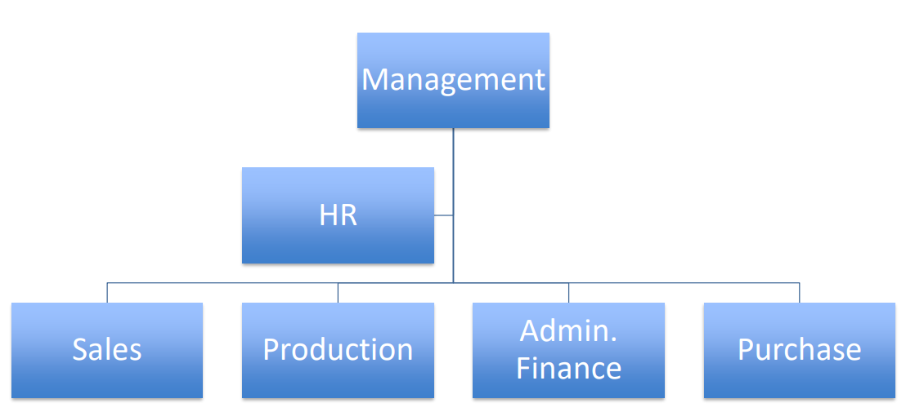
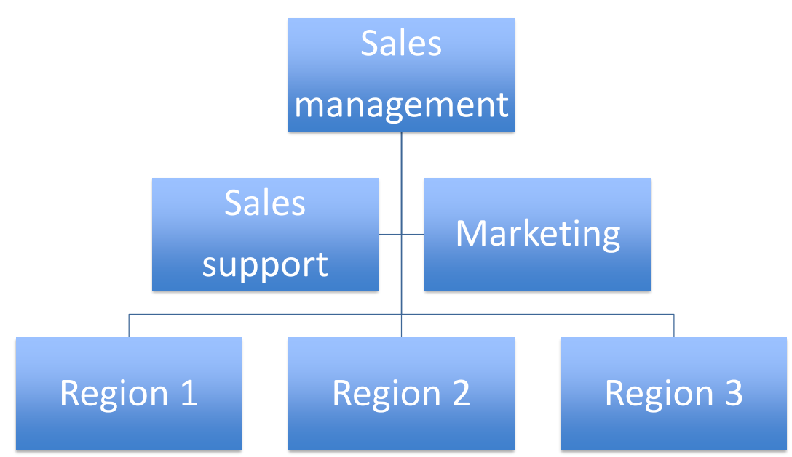
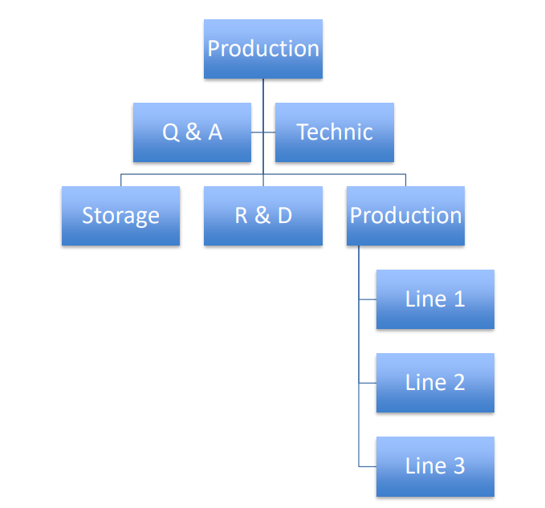
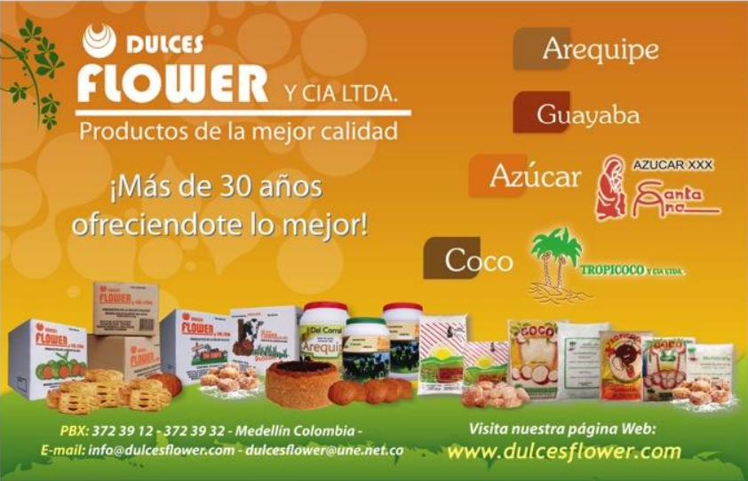
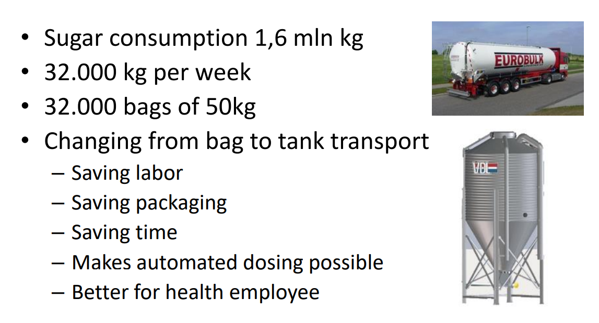

# Từ doanh nghiệp gia đình địa phương đến chiến lược tăng trưởng toàn quốc: Hành trình tái cấu trúc của Dulces Flower

Trong ngành thực phẩm, đặc biệt là bakery ingredients, tăng trưởng không chỉ đến từ “sản phẩm ngon”. Nó đến từ chiến lược đúng, tổ chức đúng và kiểm soát chất lượng bài bản.

Dulces Flower là một doanh nghiệp gia đình có hơn 30 năm kinh nghiệm tại Medellin. Nhưng khi thị trường thay đổi, hệ thống siêu thị phát triển mạnh, chuỗi bakery mở rộng nhanh và cạnh tranh ngày càng chuyên nghiệp hơn — mô hình vận hành cũ không còn đủ để đảm bảo vị thế tương lai.

Đó là lúc một chiến lược tái cấu trúc toàn diện trở nên cần thiết.

## Bối cảnh dự án

**Quốc gia:** Colombia **Ngành hàng:** Bakery ingredients – Arequipe & sản phẩm liên quan **Quy mô:** 85 nhân sự, doanh nghiệp gia đình, hoạt động từ 1977**Thị trường trọng tâm:** Medellin & khu vực Antioquia

### Thách thức ban đầu

Phân tích SWOT cho thấy:

**Strengths**

- Sản phẩm có hương vị tốt
- Cơ sở sản xuất sạch sẽ
- Quan hệ khách hàng tốt tại Medellin
- Tài chính độc lập
- Tinh thần gia đình gắn kết

**Weaknesses**

- Không có chiến lược marketing rõ ràng
- Không hiện diện tại các thành phố lớn như Bogotá
- Chưa có quality certification (HACCP / ISO)
- Quy trình khiếu nại chưa được chuẩn hóa
- Sản phẩm chưa đa dạng
- Tổ chức chưa rõ ràng vai trò & trách nhiệm
- Phân phối chưa phủ toàn quốc

Trong khi đó, đối thủ cạnh tranh:

- Có automated production
- Shelf life dài hơn
- Chứng nhận chất lượng
- Đội ngũ sales lớn
- Phủ hệ thống siêu thị mạnh

Dulces Flower mạnh tại địa phương, nhưng thiếu nền tảng để cạnh tranh cấp quốc gia.

## Phương pháp tiếp cận của HLG Mooren Consulting

Chúng tôi triển khai dự án theo 3 bước chiến lược:

### 1\. Phân tích thị trường & SWOT chuyên sâu

- Đánh giá thị phần theo từng khu vực
- So sánh năng lực cạnh tranh với các đối thủ lớn
- Phân tích chuỗi phân phối và mô hình distributor

### 2\. Xây dựng chiến lược tăng trưởng 5 năm

- Cấu trúc lại tổ chức theo hướng marketing-driven
- Thiết kế lại hệ thống sales & distributor policy
- Xây dựng lộ trình quality certification
- Tối ưu hóa sản xuất & logistics

### 3\. Triển khai cụ thể theo từng phòng ban

Từ quản trị, sản xuất, sales đến complaint management và ERP.

Chuyên môn cốt lõi được highlight trong dự án này:**Marketing Strategy + Distribution Strategy + Food Safety & Process Optimization**

## Giải pháp cụ thể đã triển khai

### 1\. Tái cấu trúc tổ chức theo mô hình chuyên nghiệp

- Thiết lập rõ 6 khối: Management – Sales – Production – Admin/Finance – Purchase – HR
- Xây dựng mô hình Sales Management theo vùng (Region 1–2–3)
- Chuẩn hóa mô tả công việc & KPI
- Lập kế hoạch ngân sách và báo cáo tháng/quý/năm

  
  
  

👉 Chuyển từ mô hình “gia đình vận hành” sang mô hình “quản trị hệ thống”.

### 2\. Xây dựng Distributor Policy bài bản

Thay vì bán hàng rải rác qua nhiều distributor nhỏ, chúng tôi:

- Đề xuất chọn top distributor tại các thành phố lớn
- Thiết lập tiêu chí lựa chọn: Partnership – Long-term – Commitment – Openness – Growth
- Áp dụng chiến lược **Push & Pull**
- Tạo checklist đánh giá distributor chuyên nghiệp

Mục tiêu: mở rộng thị trường nhưng vẫn kiểm soát thương hiệu.

### 3\. Chiến lược Marketing & Product Development

- Chuẩn hóa toàn bộ packaging: một logo, một màu sắc, một nhận diện
  
- Tạo Dulces Flower Group (holding structure)
- Phát triển phân khúc mới:
  - Arequipe consumer packaging cho bakery
  - Arequipe cho coffee segment
  - Portion pack 10–15g để sampling

- Áp dụng pricing strategy theo từng phân khúc: industry, bakery chains, foodservice

Từ một doanh nghiệp sản xuất, Dulces Flower bắt đầu tư duy như một thương hiệu.

### 4\. Nâng cấp sản xuất & chất lượng (Food Safety)

- Khuyến nghị triển khai HACCP / ISO 22000
- Thiết lập hệ thống complaint handling chuẩn hóa
- Ứng dụng ERP hiệu quả hơn
- Tối ưu hóa quy trình nấu & kiểm soát nhiệt độ
- Đề xuất chuyển từ sugar bags sang bulk tank transport:
  - Giảm lao động
  - Giảm chi phí
  - Tăng consistency
  - Tạo điều kiện tự động hóa dosing system

Từ batch-based sang system-based production.

### 5\. Chuẩn hóa quy trình thay đổi (Change Management)

- Truyền thông nội bộ rõ ràng
- Đào tạo nhân sự
- Thiết lập change agents
- Đo lường mức độ áp dụng
- Khen thưởng thành công

Vì chiến lược chỉ thành công khi con người thực sự thay đổi.

## Giá trị mang lại

Chiến lược được xây dựng nhằm:

- Chuẩn bị nền tảng mở rộng ra các thành phố lớn
- Tăng năng lực cạnh tranh với doanh nghiệp đã tự động hóa
- Nâng cao độ tin cậy thương hiệu trong hệ thống siêu thị
- Tăng tính nhất quán sản phẩm
- Giảm chi phí sản xuất dài hạn
- Tạo tiền đề đạt chứng nhận quốc tế

Từ một doanh nghiệp mạnh về “taste”, Dulces Flower có lộ trình trở thành doanh nghiệp mạnh về “system”.
