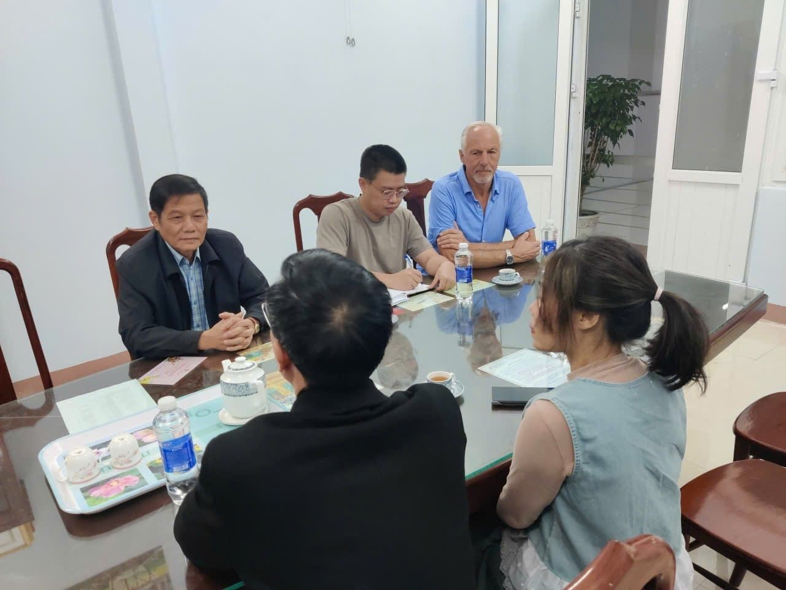
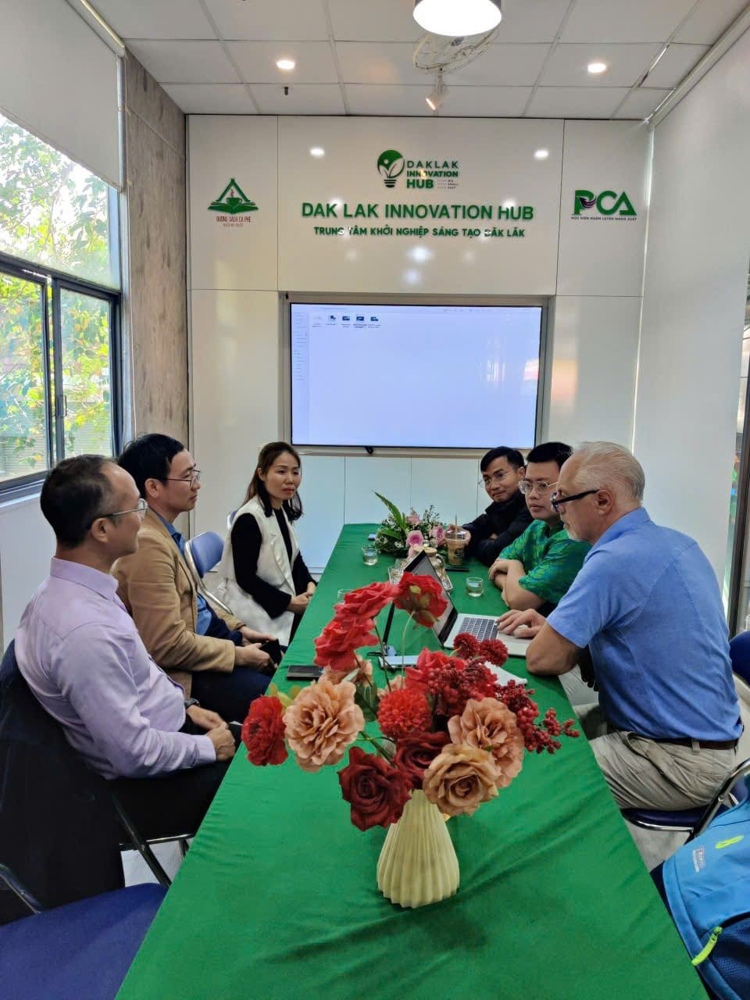

I’ve just completed my PUM assignment in Buon Ma Thuot, Vietnam, supporting a local SME producing medicinal mushrooms.

Over the past period, I had the opportunity to work together with a committed team on strengthening their marketing & sales strategy, and on identifying practical improvements to further optimize and professionalize their production processes.

What I value most in projects like these is the combination of entrepreneurship, sustainability, and local impact. This company is contributing to the community through responsible production and job creation, while building a promising business with strong potential for the future.

Thank you to the team for the warm collaboration, openness, and willingness to improve and grow. I’m proud to have been able to contribute — and I look forward to seeing the next steps and results.

#PUM #Vietnam #SME #SustainableBusiness #MedicinalMushrooms #MarketingStrategy #SalesStrategy #Operations #LocalImpact

  
  

  
  

