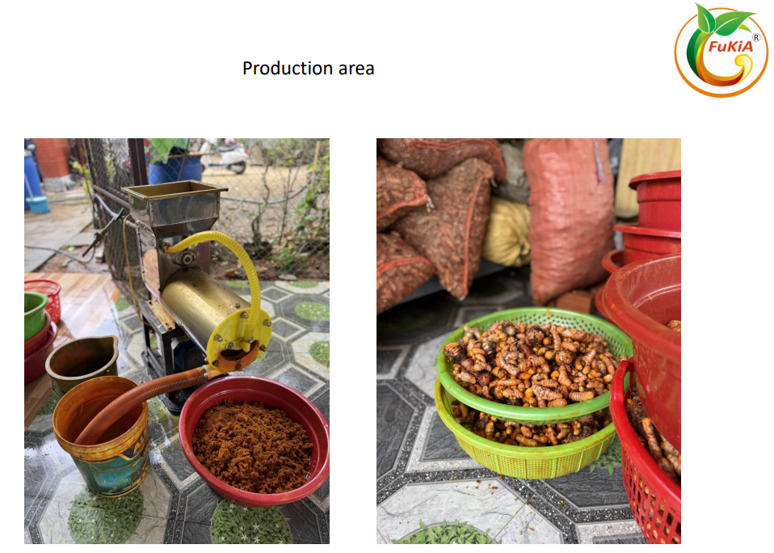
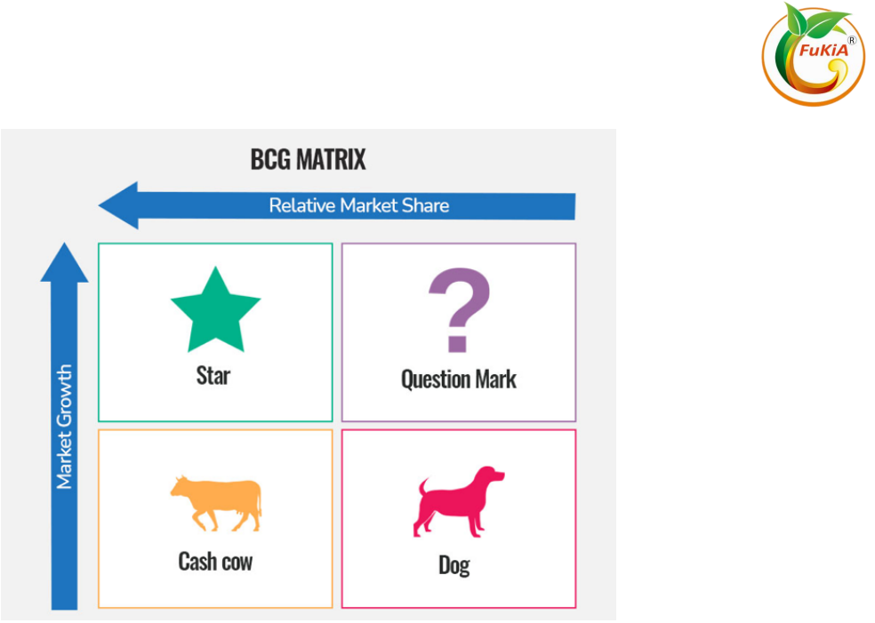
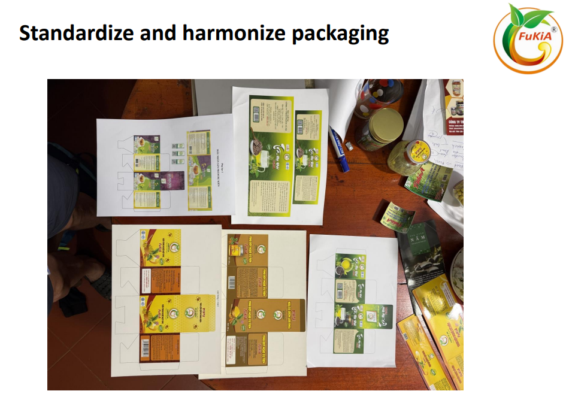
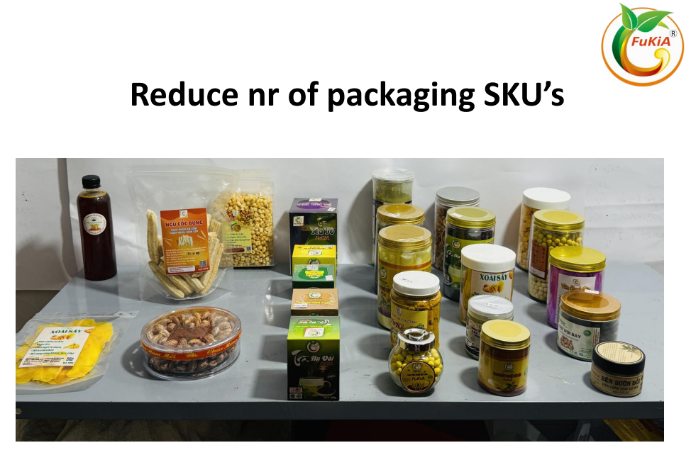

# From a Small Local Enterprise to a Standardized Agricultural Brand: A Comprehensive Growth Strategy for Fukia

Many agricultural businesses in Vietnam face the same challenge: strong local products and sourcing capabilities—but no structured strategy for sustainable growth.

Fukia, based in Thanh Binh, Da Nang, faced a similar situation. The company had a portfolio of 23 products, strong local farmer connections, and a sustainability positioning—but lacked the governance systems, brand structure, and distribution strategy required for scalable growth.

The key question was:  
How can a local agricultural business evolve into a structured, profitable brand capable of nationwide expansion—and eventually export?

---

## Project Background

- **Country:** Vietnam
- **Location:** Thanh Binh – Da Nang
- **Industry:** Processing and trading of spices, teas, and local agricultural products
- **Portfolio:** 23 SKUs (spices, turmeric starch, perilla tea, dried fruit, nuts, etc.)

### Key Challenges

Internal assessment revealed:

- Small operational scale
- No precise administrative system
- Inconsistent packaging design
- Limited financial management knowledge
- ISO 22000 certification existed, but without practical protocols
- Wide product range without strategic focus
- No clear B2B/B2C distribution strategy

Meanwhile, the market presented significant opportunities:

- Rapid growth of healthy food trends
- Expanding gift market
- Strong online sales growth
- Export potential to neighboring countries

Fukia had strong local sourcing and sustainability values—but lacked strategic concentration.

---

## HLG Mooren Consulting’s Approach

We structured the advisory around five strategic pillars:

1️⃣ Clarify Mission – Vision – Values  
2️⃣ Conduct SWOT analysis & strategic repositioning  
3️⃣ Define product strategic focus  
4️⃣ Build brand & distribution model  
5️⃣ Establish KPI systems & financial planning

Core expertise highlighted:  
**Marketing Strategy + Brand Positioning + Distributor Strategy + Strategic Focus**

---

## Key Solutions Implemented

### 1️⃣ Brand Repositioning

**Mission:**  
Processing and trading local agricultural products with commitment to quality, transparency, and community development in Da Nang.

**Vision:**  
Become a sustainable agricultural company that inspires healthy eating and environmental responsibility.

We repositioned Fukia from a “small-scale producer” to a  
**“Healthy Local Food Brand from Da Nang.”**

---

### 2️⃣ Strategic Focus on Two Core Products

Instead of spreading resources across 23 SKUs, we recommended focusing on:

- **KB1: Turmeric Starch**
- **KB2: Perilla Tea**

These products offered higher margins and stronger scalability.

Strategic measures included:

- Made-to-stock production model
- Defined minimum & maximum stock levels
- Lead time optimization
- FIFO implementation

Shift from “multi-product small batches” to “focused scalable production.”

---

### 3️⃣ Packaging Standardization & Brand Harmonization

**Current situation:**

- Inconsistent packaging
- Excessive packaging SKUs

**Solutions:**

- Reduce packaging SKU complexity
- Standardize and harmonize design
- Build a uniform brand identity
- Strengthen storytelling with origin branding:  
  Vietnam – Da Nang – Thanh Binh – farm-specific sourcing

Branding principle:  
**Trust → Consistency → Transparency → Repeat Buying**

---

### 4️⃣ Clear Separation of B2C & B2B Distribution Strategies

We defined distinct channel characteristics:

**B2C**

- Emotional buying behavior
- Branding-driven
- Fixed pricing
- Pull strategy
- Social media & e-commerce (Shopee, TikTok, Instagram, etc.)

**B2B**

- Relationship-driven
- Bulk packaging
- Contract-based pricing
- Push strategy
- LinkedIn, exhibitions, brochures

Critical principle: Avoid channel conflict between B2C and B2B.

We developed a professional distributor selection checklist based on:  
**Partnership – Long-term orientation – Commitment – Openness – Growth potential**

---

### 5️⃣ KPI Implementation & Financial Discipline

- Production KPIs (kg per batch, labor hours, units packed)
- Sales KPIs (visits per day, new customers per week, repeat purchase rate)
- 5-year strategic budgeting
- Monthly reporting: actual vs. budget

Shift from “intuition-based management” to “data-driven governance.”

---

### 6️⃣ Organic Certification Roadmap

Strategic preparation included:

- Selecting farmers based on defined criteria
- Establishing production protocols
- Biannual inspections
- Agreement on volume and price range

Organic positioning is not just certification—it is the foundation for export readiness.

---

## Value Delivered

The strategy aimed to:

- Concentrate resources on high-margin products
- Increase brand consistency
- Standardize financial management systems
- Expand B2C through online and retail channels
- Develop professional B2B distribution networks
- Prepare for organic certification and export markets

From a diversified local enterprise, Fukia now has a structured roadmap to become a scalable, sustainable agricultural brand with long-term strategic direction.
