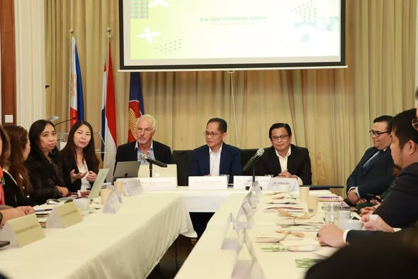
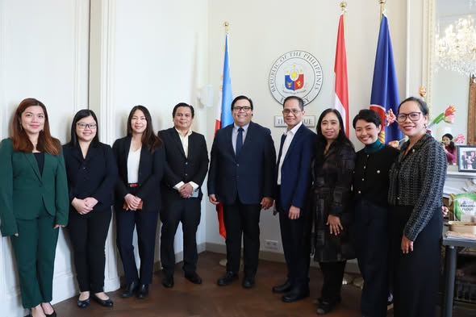
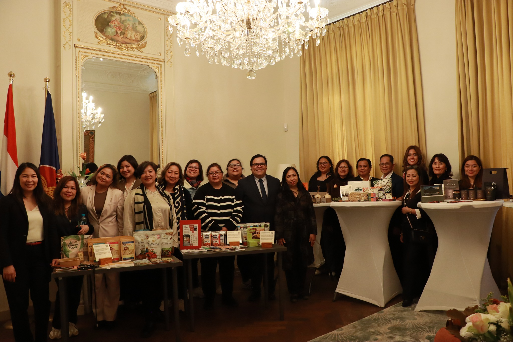

# Từ “Novel Food” đến thị trường EU: Chiến lược thâm nhập châu Âu cho ngành pili Philippines

Việc được EU phê duyệt là “novel food” không đồng nghĩa với việc sản phẩm tự động bán được tại châu Âu. Đối với nhiều doanh nghiệp thực phẩm, đây mới chỉ là tấm vé vào cửa. Thách thức thực sự bắt đầu sau đó: hiểu hệ thống quy định EU, cấu trúc phân phối, hành vi tiêu dùng và chiến lược định vị phù hợp từng quốc gia.

Sứ mệnh “Food Philippines Outbound Business Mission” do Bộ Thương mại và Công nghiệp Philippines (DTI) dẫn đầu tại Hà Lan và Bỉ đã được tổ chức trong bối cảnh đó — với mục tiêu rõ ràng: **xây dựng nền tảng thâm nhập bền vững cho sản phẩm pili tại châu Âu**.

📌 Nguồn tham khảo: Xem thông tin chi tiết về “Food Philippines Outbound Business Mission” do DTI Philippines và PTIC Brussels chia sẻ tại đây:
👉 https://www.facebook.com/ptic.brussels/posts/the-department-of-trade-and-industry-dti-philippines-recently-led-a-food-philipp/485780964121211/

## Bối cảnh dự án

- **Tổ chức chủ trì:** DTI Philippines (Region V Bicol)
- **Hỗ trợ:** CITEM, DA Regional Field Office 5, PTIC Brussels
- **Thời gian:** 24–25 tháng 10
- **Thành phần:** 9 nhà xuất khẩu từ Bicol
- **Sản phẩm:** Pili nuts và các sản phẩm chế biến từ pili (food & non-food)
- **Bối cảnh pháp lý:** EU phê duyệt pili là novel food (02/2023)

Trước đó, pili Philippines đã xuất khẩu sang Mỹ, Nhật Bản, Saudi Arabia, Trung Quốc và một số thị trường châu Âu. Tuy nhiên, EU là thị trường đòi hỏi cao về:

- Novel Food Regulation
- Food safety & traceability
- Labeling & allergen declaration
- Sustainability & ESG compliance
  

Việc tiếp cận EU đòi hỏi chiến lược, không chỉ là cơ hội.

## Phương pháp tiếp cận chiến lược

Trong các business roundtable tại Đại sứ quán Philippines ở The Hague và Brussels, cách tiếp cận được xây dựng dựa trên ba trụ cột:

### 1️⃣ Regulatory Intelligence – Hiểu hệ thống trước khi bán

Tại Hà Lan, ông Hugo Mooren (Senior Food Expert, Netherlands) đã hướng dẫn:

- Cách tiếp cận theo EU harmonized food regulations
- Phân biệt giữa quy định cấp EU và yêu cầu đặc thù từng quốc gia
- Tầm quan trọng của compliance trước khi đàm phán thương mại

Song song đó, tại Brussels, chuyên gia chính sách EU đã phân tích sâu:

- Cơ chế novel food authorization
- Trách nhiệm pháp lý khi nhập khẩu
- Vai trò của nhà nhập khẩu EU trong chuỗi giá trị

Thông điệp cốt lõi:**Regulatory compliance là điều kiện tiên quyết để xây dựng niềm tin với importer châu Âu.**

### 2️⃣ Market Entry Strategy – Hà Lan như cửa ngõ chiến lược

Hà Lan là nhà nhập khẩu hạt lớn nhất EU nhờ cảng Rotterdam. Vì vậy, chiến lược được khuyến nghị:

- Xem Hà Lan là “gateway market”
- Làm việc với importer chuyên hạt và distributor chuyên ngành
- Tối ưu logistics và testing thông qua đối tác địa phương

Đoàn đã làm việc với:

- Doanh nghiệp xử lý logistics (cargo handling)
- Phòng thí nghiệm kiểm nghiệm sản phẩm hạt

Điều này giúp doanh nghiệp Philippines hiểu rõ yêu cầu kiểm định, aflatoxin control, moisture level và testing protocol tại EU.

### 3️⃣ Retail & Consumer Insight – Hiểu người mua cuối cùng

Tại Brussels, đoàn đã khảo sát thực tế:

- Luxury supermarkets
- Specialty stores
- HORECA channel
- Cửa hàng organic & vegan

Bài học rút ra:

- EU market không đồng nhất
- Organic, vegan, sustainability là xu hướng rõ ràng
- Storytelling về nguồn gốc và tác động xã hội có giá trị cao

Brussels với cộng đồng quốc tế đa dạng cho phép đánh giá phản ứng người tiêu dùng với sản phẩm ethnic premium như pili.

## Giải pháp & Định hướng chiến lược cho ngành pili

Từ mission này, các định hướng chiến lược được xác lập:

### 🔹 1. Định vị sản phẩm

- Premium, healthy, sustainable
- Origin-based storytelling (Bicol Region)
- Nhấn mạnh yếu tố cộng đồng & ESG

### 🔹 2. Chuẩn hóa chất lượng & hồ sơ kỹ thuật

- Hoàn thiện novel food compliance
- Tối ưu labeling theo từng thị trường
- Chuẩn bị đầy đủ technical dossier cho importer

### 🔹 3. Lựa chọn kênh thâm nhập

- Importer chuyên hạt tại Hà Lan
- Distributor niche cho organic/vegan segment
- HORECA cao cấp cho sản phẩm chế biến

### 🔹 4. Chiến lược dài hạn

- Xây dựng quan hệ với importer EU
- Thử nghiệm thị trường (pilot batch)
- Tăng dần sản lượng thay vì push volume ngay từ đầu

Thị trường EU ưu tiên ổn định & consistency hơn là tăng trưởng đột biến.

Giá trị mang lại

---

Mission này không chỉ là hoạt động xúc tiến thương mại — mà là:

- Xây dựng năng lực xuất khẩu thực tế
- Tăng hiểu biết về regulatory landscape EU
- Tạo kết nối trực tiếp với importer & HORECA
- Định vị pili Philippines như một sản phẩm premium có trách nhiệm

Quan trọng hơn, ngành pili đã có một roadmap rõ ràng cho EU thay vì tiếp cận theo cách thử-sai.

## Doanh nghiệp của bạn đã sẵn sàng cho thị trường EU?

Nếu sản phẩm của bạn đã được phê duyệt nhưng chưa có chiến lược thâm nhập rõ ràng, chưa hiểu cấu trúc importer, chưa chuẩn hóa hồ sơ pháp lý — thì việc xuất khẩu sẽ luôn rủi ro.

**Doanh nghiệp bạn đang tìm cách thâm nhập thị trường EU?Hãy liên hệ HLG Mooren Consulting để xây dựng chiến lược market entry phù hợp và bền vững.**
