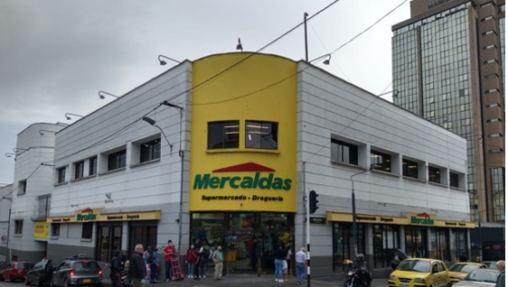
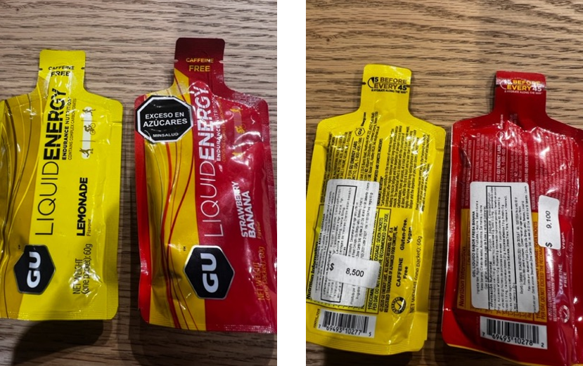
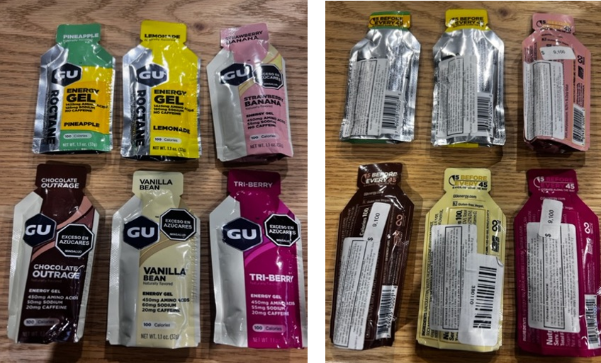

# Từ sản xuất thủ công thiếu kiểm soát đến chiến lược tăng trưởng bền vững: Hành trình tái cấu trúc của Dulces Flower y Cia (SOS)

Khi một doanh nghiệp thực phẩm phụ thuộc 50% doanh thu vào một khách hàng và 90% hoạt động tập trung vào một phân khúc duy nhất, rủi ro không còn là giả định — mà là hiện hữu. Dulces Flower y Cia (SOS) tại Colombia đang tăng trưởng trong thị trường có tiềm năng, nhưng nền tảng vận hành và chiến lược chưa đủ vững để mở rộng quy mô.

Bài toán đặt ra không chỉ là tăng doanh số — mà là xây dựng một cấu trúc tổ chức, hệ thống chất lượng và chiến lược thị trường đủ mạnh để phát triển toàn quốc.

Bối cảnh dự án

---

- **Quốc gia:** Colombia
- **Ngành:** Thực phẩm chế biến từ trái cây
- **Thị trường:** B2B bakery, foodservice, một phần retail
- **Tình trạng ban đầu:** \* 50% doanh thu từ 1 khách hàng

      *   90% tập trung vào bakery (3 khách hàng lớn)

      *   Không có chứng nhận chất lượng (HACCP/ISO)

      *   Không có phân phối toàn quốc

      *   Chất lượng sản phẩm không ổn định

      *   Sản xuất thủ công, phụ thuộc tay nghề nhân viên

      *   Vấn đề vệ sinh và an toàn nhà máy

  

## Phương pháp tiếp cận của HLG Mooren Consulting

Chúng tôi tiếp cận dự án theo 4 bước chiến lược:

### 1️⃣ Phân tích SWOT & Rủi ro tập trung khách hàng

Xác định rủi ro phụ thuộc key-account và cấu trúc doanh thu thiếu cân bằng.

### 2️⃣ Tái cấu trúc tổ chức hướng Marketing & NPD

- Thiết lập cấu trúc Sales theo vùng
- Phân tách rõ Sales – Marketing – Production – QA
- Xây dựng business plan 5 năm

### 3️⃣ Chuẩn hóa hệ thống chất lượng

Định hướng chọn hệ thống như:

- HACCP
- ISO 22000
- GMP
- Organic certification

Chuyển từ “sản xuất theo kinh nghiệm” sang “sản xuất theo hệ thống”.

### 4️⃣ Chiến lược mở rộng thị trường quốc gia

- Lựa chọn Top 5 distributor tại các thành phố lớn
- Xây dựng chính sách distributor dài hạn
- Triển khai Push & Pull strategy
- Phân tích định giá theo từng phân khúc (cost-plus, competitive, penetration…)

## Giải pháp cụ thể đã triển khai

### 🔹 1. Cải thiện điều kiện sản xuất & an toàn thực phẩm

- Đóng kín khu sản xuất, kiểm soát côn trùng và bụi
- Cải tạo sàn nhà xưởng (nguy cơ mất an toàn cao)
- Hiệu chuẩn cân điện tử (tránh sai số CCP)
- Thiết lập quy trình kiểm soát nguyên liệu đầu vào
- Áp dụng FIFO và kiểm soát Best Before Date

Chuyển nhà máy từ mức rủi ro cao sang chuẩn hóa theo GFSI framework.

### 🔹 2. Xây dựng chiến lược danh mục sản phẩm (BCG Matrix)

- Phân loại Cash cow / Star / Question mark / Dog
- Đề xuất tạo “New Star”: Energy fruit gels
- Phát triển fruit syrups cho bar & restaurant

Chiến lược không còn dàn trải — mà tập trung vào sản phẩm có giá trị gia tăng cao.

### 🔹 3. Mở rộng phân phối toàn quốc

- Chính sách Distributor dựa trên Partnership – Long term – Commitment – Growth
- Checklist đánh giá distributor chuyên nghiệp
- Tập trung thành phố lớn trước (Bogota, Medellin, Cali…)

Mục tiêu: giảm rủi ro tập trung khách hàng và xây dựng thị phần bền vững.

### 🔹 4. Chuẩn hóa ERP & Quản trị dữ liệu

- Giảm giấy tờ thủ công
- Chuẩn hóa dữ liệu tập trung
- Tăng độ chính xác thông tin tài chính
- Hỗ trợ ra quyết định dựa trên số liệu

Nguyên tắc rõ ràng: “Rubbish in = rubbish out”.

### 🔹 5. Chiến lược Outsourcing có chọn lọc

- Tập trung vào core competency
- Thuê ngoài sản phẩm cơ bản
- Giải phóng nguồn lực cho NPD và marketing

## Giá trị mang lại

Chiến lược đã được xây dựng nhằm:

- Giảm rủi ro phụ thuộc khách hàng lớn
- Chuẩn hóa sản xuất theo tiêu chuẩn quốc tế
- Tăng giá trị gia tăng sản phẩm
- Xây dựng nền tảng phân phối toàn quốc
- Chuẩn bị cho mở rộng xuất khẩu

Quan trọng nhất: SOS có một lộ trình chuyển đổi từ doanh nghiệp sản xuất nhỏ sang thương hiệu thực phẩm có cấu trúc bài bản.

## Doanh nghiệp bạn có đang phụ thuộc quá nhiều vào một khách hàng?

Nếu 50% doanh thu đến từ một đối tác, nếu chất lượng chưa được chuẩn hóa, nếu thị trường chưa được mở rộng toàn quốc — rủi ro là vấn đề thời gian.

**Doanh nghiệp bạn đang gặp thách thức tương tự?Hãy liên hệ HLG Mooren Consulting để xây dựng chiến lược tăng trưởng bền vững.**
