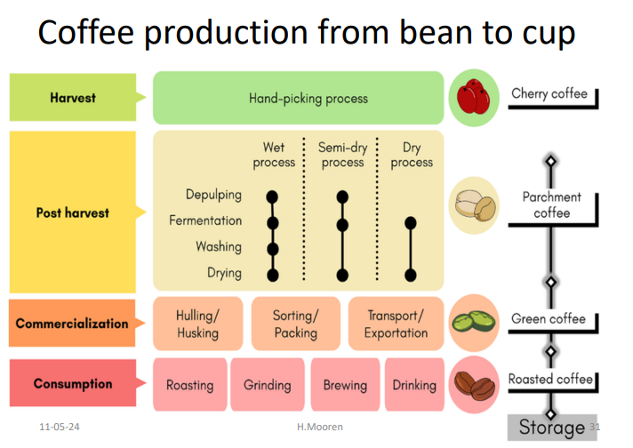
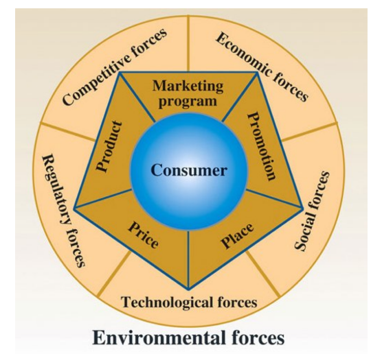

## Breaking Free from the Small-Scale Trap: A Value Chain Standardization & Brand Strategy for a Specialty Coffee Enterprise

You own a specialty coffee line scoring 85+ points, backed by a compelling social-impact story—yet sales remain modest and dependent on fragmented export orders. That was precisely the challenge faced by a specialty coffee business in the Cauca Valley (South America) before HLG Mooren Consulting intervened.

---

## Project Background: A Raw Gem Without Structural Craftsmanship

Operating in a region with exceptional terroir but structural instability, the company sourced coffee from smallholder farmers with the ambition of generating sustainable social impact.

Although green bean quality was consistently rated high, the business was constrained by critical weaknesses:

- Extremely lean organization (one person managing nearly all functions)
- No structured marketing strategy
- Major inconsistency in product quality

Each farmer applied different varietals and fermentation methods, resulting in unstable batch-to-batch performance. Simultaneously, the company had to compete with dominant national coffee federations and powerful domestic retail chains.

The business had strong raw material quality—but no structural system to scale.

---

## HLG Mooren Consulting’s Approach: Re-Architecting the Entire Value Chain

Rather than focusing on superficial marketing adjustments, consultant Hugo Mooren conducted a full “Bean-to-Cup” value chain assessment.

We applied strategic tools including:

- SWOT Analysis
- Porter’s Five Forces
- BCG Matrix

The objective was to redesign both operational foundations and market positioning.

---

## Strategic Solutions Implemented

HLG Mooren Consulting developed a focused 5-year strategic roadmap built on core pillars:

### 🔹 1. Protocol Standardization Across the Supply Chain

We established strict operational standards for partner farmers, covering:

- Variety selection
- Water usage management
- Controlled fermentation methods
- Harvesting criteria

The goal was to create a signature blend capable of consistently delivering a premium positioning (80+ score minimum) with stable sensory performance across batches.

The shift was clear:  
From variable artisan sourcing → to controlled specialty production.

---

### 🔹 2. Rebranding & Market Repositioning

We recommended a strategic renaming to reduce academic or overly technical connotations (removing “organic” from the core brand name where it limited flexibility).

Actions included:

- Complete redesign of logo and visual identity
- Modernized packaging system
- Strong origin storytelling (Cauca Valley)
- Clear articulation of social-impact mission

The brand moved from niche supplier perception to structured premium identity.

---

### 🔹 3. Strategic Outsourcing & Focus on Core Competency

Instead of internally managing non-core functions, we advised:

- Selective outsourcing of logistics and certain processing stages
- Concentration on quality control, brand building, and strategic partnerships

This allowed the company to free managerial bandwidth and improve operational discipline.

---

## Value Delivered

The transformation achieved:

- Stabilized product quality across harvest cycles
- Reduced operational overload from a single-person structure
- Strengthened negotiation power with buyers
- Created a scalable brand platform
- Enabled positioning against larger commercial competitors

From fragmented trading to structured specialty branding, the company now operates with a defined growth roadmap and competitive architecture.

---

## Is Your Value Chain Overloaded and Underperforming?

If your specialty product scores high but margins remain volatile, if your supply chain lacks consistency, and if your brand lacks structured positioning—it may be time to redesign your value chain.

**Let HLG Mooren Consulting help you redraw your growth roadmap and build a system that scales sustainably.**
