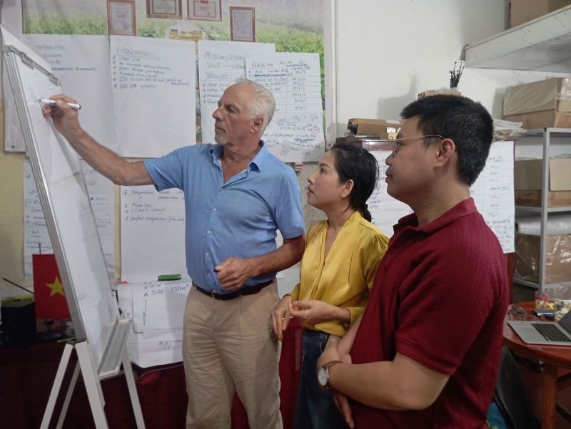
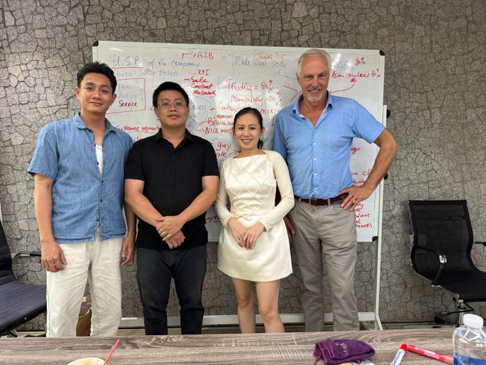
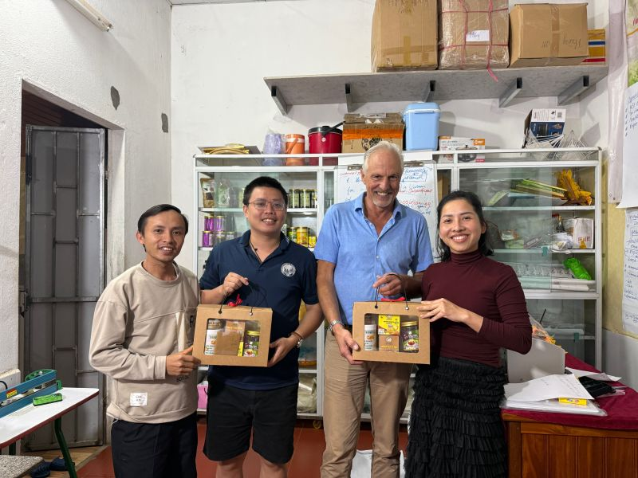

This week I successfully completed another PUM project in Vietnam. The main assignment was with a company producing turmeric starch, where I supported the owner of the busnisse with strategy and further business development and insights.

In addition, I had the opportunity to advise a concrete company on specific strategic challenges.
An intensive but very rewarding week with good results and strong collaboration. Thank you to everyone involved for the trust and cooperation.

  
  

