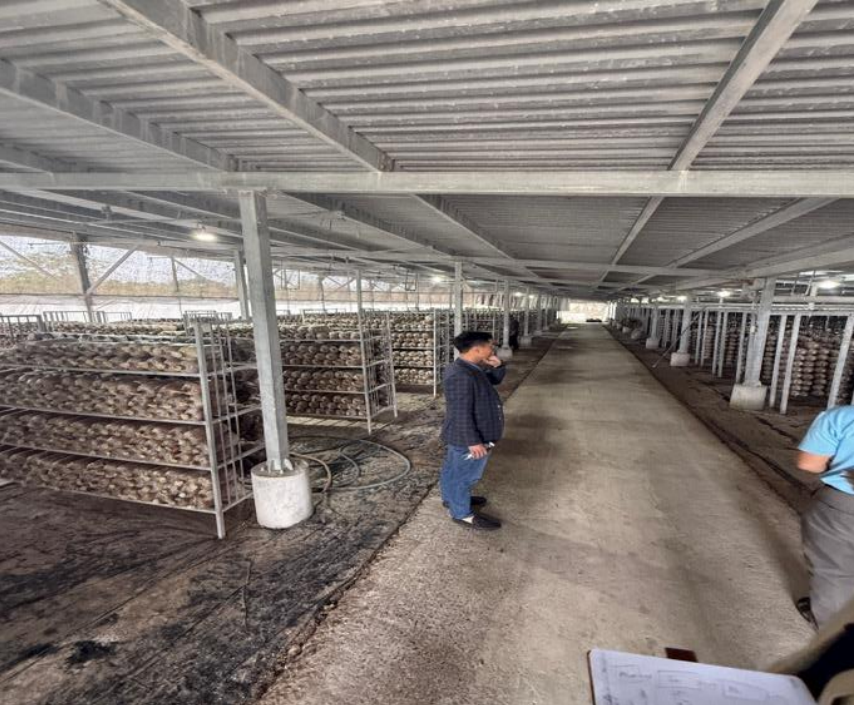
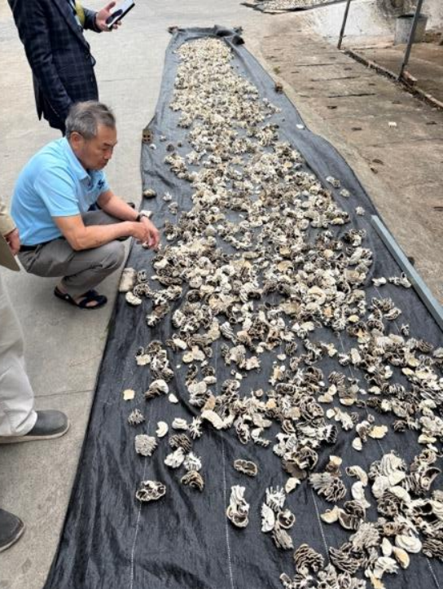
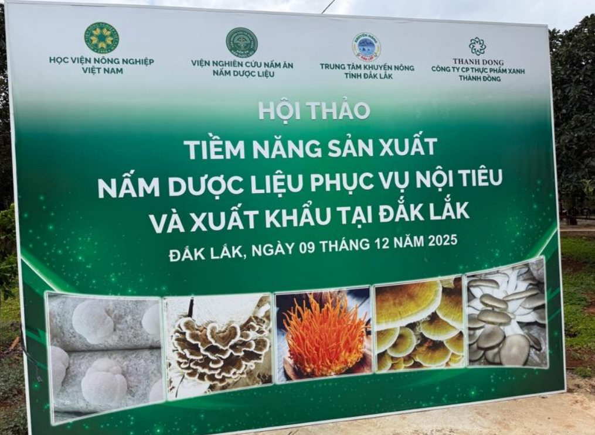
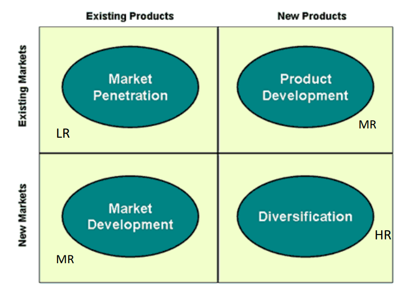

# Từ 95% dư thừa công suất đến chiến lược tăng trưởng 2026–2030: Bước ngoặt chiến lược của Thanh Dong Mushroom

Một trang trại có năng lực sản xuất lớn nhưng hoạt động dưới công suất 95%. Một thị trường mà nhu cầu vượt cung, nhưng doanh nghiệp vẫn chưa đạt lợi nhuận bền vững. Đây chính là nghịch lý mà Thanh Dong Company tại Buôn Ma Thuột đang đối mặt.

Bài toán không nằm ở sản phẩm — vì nấm Linh Chi và dược liệu đang tăng trưởng mạnh tại Việt Nam. Vấn đề nằm ở **chiến lược thị trường, cấu trúc kênh phân phối và quản trị lợi nhuận**.

## Bối cảnh dự án

- **Địa điểm:** Buôn Ma Thuột, Đắk Lắk, Việt Nam
- **Ngành:** Nấm dược liệu (Linh Chi, Turkey Tail…)
- **Mô hình:** Trồng – sấy – đóng gói – B2B & B2C
- **Vấn đề chính:**
      *   95% dư thừa công suất trang trại

      *   70% doanh thu phụ thuộc 2 khách hàng B2B

      *   Không có chứng nhận ISO 22000 hoàn chỉnh

      *   Không có nhân sự chuyên trách sales & quality

      *   Không có phân tích lợi nhuận theo khách hàng / sản phẩm

      *   Điều kiện nhà xưởng chưa tối ưu (kiểm soát độ ẩm, truy xuất nguồn gốc)
  

Trong khi đó, theo phân tích thị trường:

- Nhu cầu nấm dược liệu vượt cung (chỉ đáp ứng ~33% nhu cầu nội địa)
- Việt Nam nhập khẩu lớn từ Trung Quốc
- Thị trường Healthy Food và Supplements tăng trưởng mạnh

Cơ hội rõ ràng. Nhưng cần chiến lược đúng.

## Phương pháp tiếp cận của HLG Mooren Consulting

Chúng tôi triển khai tư vấn theo 5 trụ cột chiến lược:

### 1️⃣ Phân tích SWOT & năng lực nội bộ

Strengths:

- Kiến thức nuôi trồng nấm
- Kết nối với trường đại học và cơ quan nhà nước
- Quy trình trồng tương đối chuẩn hóa
- Sản xuất bền vững (solar energy)

Weaknesses:

- Không rõ profitability per SKU
- Không có food safety certificate hoàn chỉnh
- Overcapacity lớn
- Phụ thuộc khách hàng

### 2️⃣ Xác định chiến lược thị trường: B2B hay B2C?

Phân tích 3 lựa chọn:

- Focus B2C (branding, margin cao, nhưng chậm)
- Focus B2B (volume nhanh, margin thấp hơn)
- Combination (B2B tài trợ cho B2C)

Khuyến nghị chiến lược:

👉 **B2B là động cơ tạo cash flow**👉 **B2C là động cơ xây dựng thương hiệu và biên lợi nhuận cao**

Nguyên tắc:“Use B2B to fund B2C — not the other way around.”

### 3️⃣ Áp dụng mô hình Ansoff & BCG

Sử dụng:

- **Ansoff Matrix** để xác định Market penetration & Product development
- **BCG Matrix** để phân loại sản phẩm thành Cash cow / Star / Question mark / Dog

Định hướng:

- Linh Chi truyền thống = Cash cow
- Tea bag B2C = Star
- Energy mushroom concept = Question mark

Chiến lược trở nên rõ ràng và có thứ tự ưu tiên.

## Giải pháp cụ thể đã triển khai

### 🔹 1. Lấp đầy công suất bằng B2B key account

- Bổ nhiệm Key Account Manager B2B
- Hợp đồng dài hạn
- Giá cạnh tranh (competitive pricing strategy)
- Đạt break-even nhanh hơn

### 🔹 2. Xây dựng thương hiệu Linh Chi dựa trên Origin Branding

- Vietnam → Dak Lak → Buon Ma Thuot → Thanh Dong Farm
- Storytelling về vùng trồng
- Phát triển packaging B2C chuyên biệt
- Định vị “Healthy – Sustainable – Transparent”

Brand không chỉ là logo — mà là niềm tin.

### 🔹 3. Chuẩn hóa hệ thống chất lượng

- Hướng tới HACCP / ISO 22000 / Organic certificate
- Thiết lập traceability
- Phân tích điều kiện độ ẩm nhà xưởng
- Chuẩn hóa quy trình sấy & đóng gói

Mục tiêu: khác biệt với nấm nhập khẩu giá rẻ thiếu kiểm soát.

### 🔹 4. Chiến lược phân phối

B2B:

- Hợp đồng trực tiếp với khách hàng lớn

B2C:

- Chọn distributor tại thành phố lớn (HCM, Hà Nội, Hải Phòng…)
- Tiêu chí: Partnership – Long term – Commitment – Growth
- Tránh conflict channel giữa B2B và B2C

### 🔹 5. Mở rộng công suất có kiểm soát

- Kế hoạch đầu tư tăng 1.8x capacity
- Phân tích sản lượng theo chu kỳ thu hoạch
- Lộ trình ngân sách đến 2030
- Tách riêng ngân sách B2B và B2C

Tăng trưởng không còn cảm tính — mà dựa trên tính toán cụ thể.

## Giá trị mang lại

Chiến lược 2026–2030 được xây dựng nhằm:

- Chuyển 95% overcapacity thành động cơ tăng trưởng
- Tạo dòng tiền ổn định từ B2B
- Xây dựng thương hiệu Linh Chi nội địa mạnh
- Giảm phụ thuộc nhập khẩu
- Chuẩn hóa hệ thống để sẵn sàng xuất khẩu
- Tăng giá trị gia tăng thay vì cạnh tranh giá rẻ

Thanh Dong không còn chỉ là một trang trại nấm — mà là một doanh nghiệp có định hướng chiến lược rõ ràng.

## Bạn đang có công suất dư thừa nhưng chưa có chiến lược thị trường rõ ràng?

Nếu doanh nghiệp của bạn có năng lực sản xuất nhưng thiếu cấu trúc thị trường, thiếu chiến lược kênh phân phối và chưa phân tích lợi nhuận theo phân khúc — tăng trưởng sẽ luôn thiếu ổn định.

**Doanh nghiệp bạn đang gặp thách thức tương tự?Hãy liên hệ HLG Mooren Consulting để xây dựng chiến lược marketing 2026–2030 phù hợp.**
